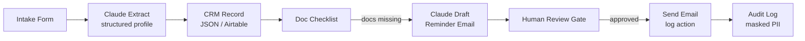

# Proposal: Client Intake, Document Reminder & CRM Workflows

**Job:** AI Automation Specialist Needed for Client Intake, Document Reminder & CRM Workflows
**Client:** UK, payment verified, new account
**Date:** 2026-06-08
**Bid:** $500

---

## Hook

Built working demos of all three workflows: intake extraction with Claude, document reminder drafting with a human review gate, and a masked audit log. Everything runs on sample data only, with GDPR notes and email masking built in.

**Demo:** https://client-intake-crm-demo-8xtkcs57t8elmmkxbzd2yg.streamlit.app
**Screenshots:** [ATTACHED]

---

## What the Demo Does

The Streamlit app has three tabs:

**Tab 1 — Client Intake:** Submit a new client via a form. Claude Haiku extracts and structures the intake into a clean JSON profile (name, company, service requested, docs required). One click saves to the CRM.

**Tab 2 — Document Checklist and Reminders:** Select any client to see which onboarding docs are submitted vs missing. For clients with gaps, generate a polite, personalised reminder email via Claude. The email routes through a human review gate: it's logged as "pending" until a human approves it in Tab 3. Nothing dispatches automatically.

**Tab 3 — CRM Log:** Full audit trail of every action. Email addresses are masked in the log. Pending reminder approvals can be confirmed here.

---

## Data Protection Approach

The demo enforces the practices your clients will require:
- Sample data only in the demo environment
- Email addresses masked in audit logs (sa***@example.com)
- Human review gate on every outbound communication
- GDPR notice visible in the UI
- In production: encrypted storage, DPA with vendors including Anthropic, role-based access, data minimisation

---

## Architecture

```
Trigger:     New client intake form submission
Input:       Client name, company, email, phone, service type, notes
Processing:  Claude Haiku extracts structured profile → CRM record created
             Doc checklist checked → Claude drafts reminder → human approves
Output:      CRM record, reminder email (after approval), audit log entry
Verify:      Audit log entry per action, email masked before logging
```



---

## Tech Stack and Timeline

**Stack:** Python, Claude Haiku (extraction and drafting), Make.com or n8n (orchestration), Airtable or Notion (CRM), your existing email provider (Gmail, Outlook, or SendGrid)

**Timeline:**
- Day 1: Scope the first workflow (intake, doc reminder, or CRM update) and map to your client's existing tools
- Day 2-3: Build and test on sample data, data flow documentation
- Day 4: Review pass, human gate testing, sign-off on data handling
- Day 5: Handoff with setup guide

**Total: 4-5 days for first test workflow**

---

## Pricing

**Phase 1 (test project):** $500 fixed
- One complete workflow built and tested (your choice: intake, doc reminder, or CRM update)
- Data flow documentation
- Human review gate built in from the start
- Sample-data testing before production connection

**Phase 2 (delivery partner arrangement):**
- Remaining two workflows
- Additional client verticals as you bring them on
- Monthly retainer for ongoing workflow builds: $600-800/month depending on volume
