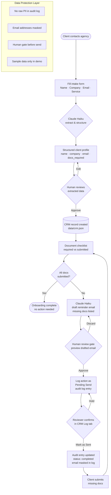
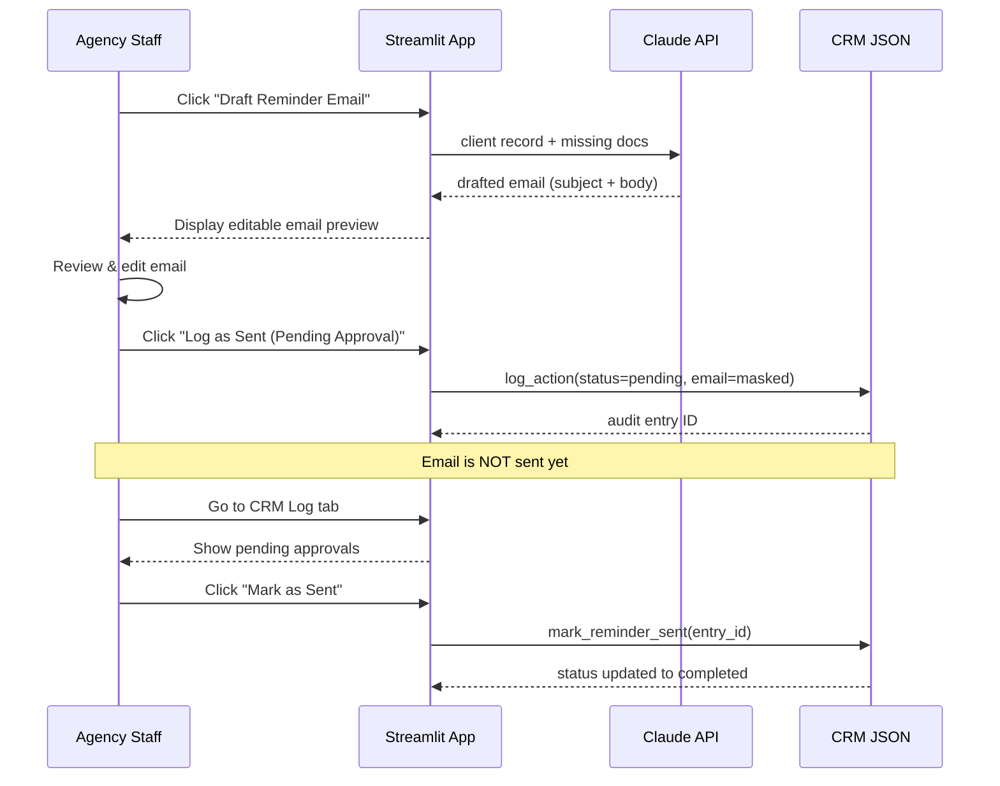

# Workflow Diagram

## End-to-End Client Onboarding Workflow

```mermaid
flowchart TD
    A([Client contacts agency]) --> B[Fill intake form\nName · Company · Email · Service]
    B --> C{Claude Haiku\nextract & structure}
    C --> D[Structured client profile\nname · company · email · docs_required]
    D --> E{Human reviews\nextracted data}
    E -->|Approve| F[(CRM record created\ndata/crm.json)]
    E -->|Edit| D

    F --> G[Document checklist\nrequired vs submitted]
    G --> H{All docs\nsubmitted?}

    H -->|Yes| I([Onboarding complete\nno action needed])

    H -->|No| J[Claude Haiku\ndraft reminder email\nmissing docs listed]
    J --> K{Human review gate\npreview drafted email}
    K -->|Discard| J
    K -->|Approve| L[Log action as\nPending Send\naudit log entry]
    L --> M{Reviewer confirms\nin CRM Log tab}
    M -->|Mark as Sent| N[Audit entry updated\nstatus: completed\nemail masked in log]
    M -->|Hold| L

    N --> O[Client submits\nmissing docs]
    O --> G

    subgraph "Data Protection Layer"
        direction LR
        P[No raw PII in audit log]
        Q[Email addresses masked]
        R[Human gate before send]
        S[Sample data only in demo]
    end
```

## Human Review Gate Detail

```mermaid
sequenceDiagram
    participant Staff as Agency Staff
    participant App as Streamlit App
    participant Claude as Claude API
    participant CRM as CRM JSON

    Staff->>App: Click "Draft Reminder Email"
    App->>Claude: client record + missing docs
    Claude-->>App: drafted email (subject + body)
    App-->>Staff: Display editable email preview

    Staff->>Staff: Review & edit email

    Staff->>App: Click "Log as Sent (Pending Approval)"
    App->>CRM: log_action(status=pending, email=masked)
    CRM-->>App: audit entry ID

    Note over Staff,CRM: Email is NOT sent yet

    Staff->>App: Go to CRM Log tab
    App-->>Staff: Show pending approvals
    Staff->>App: Click "Mark as Sent"
    App->>CRM: mark_reminder_sent(entry_id)
    CRM-->>App: status updated to completed
```
